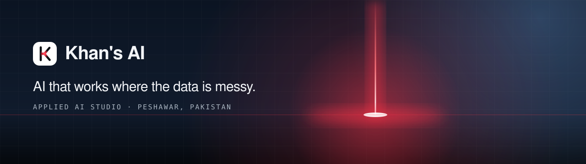

  

  <b>Applied AI studio · Peshawar, Pakistan</b> 
  Computer vision, predictive models and agentic systems, engineered into products people use every day.

  
  

---

## What we do

| | Capability | What it means for you |
|---|---|---|
| 👁️ | **Computer vision** | Turning photos, scans, drawings and medical images into structured data you can measure and act on. |
| 📈 | **Predictive ML** | Models for risk, failure and demand, evaluated honestly on data they have never seen. |
| 🤖 | **LLM & agentic systems** | Assistants and agents that read documents, fill forms and run multi-step work, with a person approving what matters. |
| 🛠️ | **Product engineering** | The app around the model: mobile, desktop, dashboards and backends a small team can run. |

## Selected work

| Project | Domain | Status |
|---|---|---|
| **HujraCart**: sales, inventory and shop discovery on one map for shopkeepers, field sales teams and customers | Retail · Geospatial | 🟢 Launching |
| **Book authentication**: unique QR code and scratch-off PIN on every printed copy to stop counterfeits | Publishing · Anti-counterfeit | 🟡 In build |
| **Tender autopilot**: finds, reads and prices public tenders; a person gives the final go-ahead | Public procurement · Automation | 🟣 Internal tool |
| **Machine failure forecasting**: digital-twin failure prediction with physics-informed features | Industry · Predictive maintenance | 🔵 Prototype |
| **Brain bleed detection**: flags intracranial haemorrhage on CT by fusing image and patient data | Healthcare · Medical imaging | 🔵 Prototype |
| **Eye-gaze phone control**: operate a phone with your eyes, for people who can't use touch | Accessibility | 🔵 Prototype |

> Client and product source code is kept private. Ask us for a walkthrough.

## Leadership

| Name | Role | Focus |
|---|---|---|
| **Abdur Rahim** | Founder & AI Lead | Computer vision, product, technical strategy |
| **Syed Muiz Halimi** | Generative AI Lead | Deep learning, generative models, RAG |
| **Muhammad Yahya** | LLM Systems Lead | LLM integration, retrieval, evaluation |
| **Tajal Hussain** | Agentic AI Lead | Autonomous agents, tool use, ML |

## Our stack

  
  
  
  
  
  
  
  
  
  

## Work with us

Have a problem with messy data? Tell us what you're working on. The first conversation is free.

📧 **khansai.contact@gmail.com** · 📍 Peshawar, Pakistan · Registered with Join IT KPK
